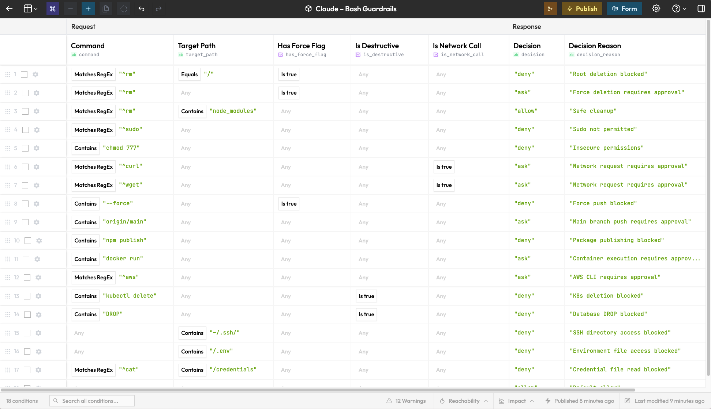
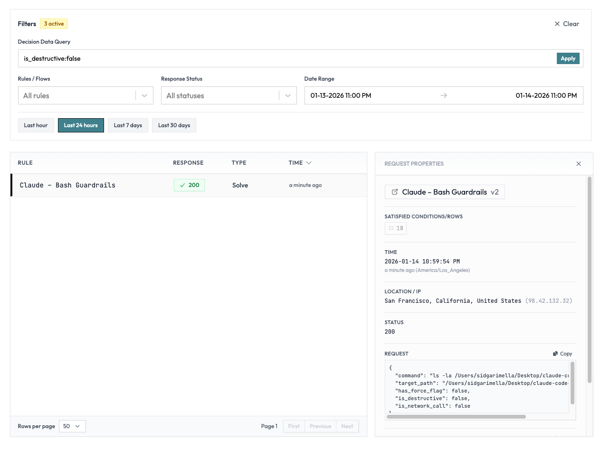

# Claude Code Guardrails



`settings.json` works if:

- You're fine editing JSON and killing Claude Code sessions every time policy changes
- Your security team is comfortable making PRs
- You don't need to know what got blocked, when, or for whom
- Basic pattern matching like `Bash(rm:*)` covers your use cases

Use this if:

- Policy changes need to apply instantly across your team—no git pull, no restart
- Security/compliance needs a clear audit trail of every blocked command
- You need conditional logic: "allow `rm -rf` on `node_modules`, deny everywhere else"
- Non-engineers need to edit rules without touching config files

##### Rulebricks gives you instant governance from one hook.

```
Claude Code → PreToolUse hook → Rulebricks API → allow / deny / ask
```

## Setup (5 minutes)

### 1. Create your rules

1. Go to [rulebricks.com](https://rulebricks.com) and create an account
2. Fork one of these templates from the "AI Agents" category:
   - **Claude – Bash Guardrails** — control shell commands
   - **Claude – File Access Policy** — control file read/write/edit
   - **MCP Tool Governance** — control MCP server operations
3. Customize the rules for your team
4. Publish the rule
5. Copy your API key from the API tab

### 2. Install

**Automatically finds your rules**

```bash
git clone https://github.com/rulebricks/claude-code-guardrails
cd claude-code-guardrails
./install.sh
```

Claude will detect your published rules and wire up the appropriate hooks.

### 3. Restart Claude Code

You're done.

## What gets checked

| Template                | Matcher             | What it controls |
| ----------------------- | ------------------- | ---------------- |
| Bash Command Guardrails | `Bash`              | Shell commands   |
| File Access Policy      | `Read\|Write\|Edit` | File operations  |
| MCP Tool Governance     | `mcp__*`            | MCP server calls |

## Configuration

Environment variables in `~/.claude/settings.json`:

```json
{
  "env": {
    "RULEBRICKS_API_KEY": "your-api-key",
    "RULEBRICKS_VERBOSE": "1"
  }
}
```

| Variable             | Description                           |
| -------------------- | ------------------------------------- |
| `RULEBRICKS_API_KEY` | Your Rulebricks API key (required)    |
| `RULEBRICKS_VERBOSE` | Set to `1` to log decisions to stderr |

## Updating rules

Edit your decision table and publish a new version. Changes apply immediately— no restart, no redeployment.

## Reviewing histories

Review the history of blocked commands in the Logs tab. You can query by tool, approval decision, and more. There are other meaningful perks to this data, like finding out which tool is being blocked the most.



## Data privacy

You're free to edit the guardrail however you'd like to redact sensitive data before it hits our platform.

Also– while this works with our cloud environment, you can also run this on private infrastructure, using your own logging provider. [Reach out](https://calendly.com/prefix-software/rulebricks?month=2026-01) if that might be of interest.

## Uninstall

```bash
# Remove hook script
rm ~/.claude/hooks/guardrail.py

# Remove from settings.json (manual)
# Edit ~/.claude/settings.json and delete:
#   - hooks.PreToolUse entry
#   - env.RULEBRICKS_* variables
```

Or, use this one-liner to remove the hook and settings:

```bash
rm ~/.claude/hooks/guardrail.py && python3 -c "
import json
p = '$HOME/.claude/settings.json'.replace('\$HOME', '$HOME')
s = json.load(open(p))
s.get('hooks', {}).pop('PreToolUse', None)
for k in list(s.get('env', {}).keys()):
    if k.startswith('RULEBRICKS_'): s['env'].pop(k)
json.dump(s, open(p, 'w'), indent=2)"
```
